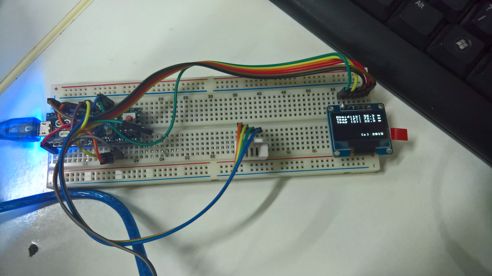
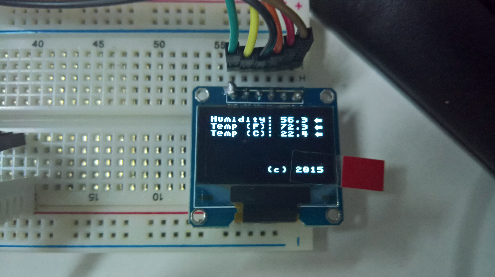
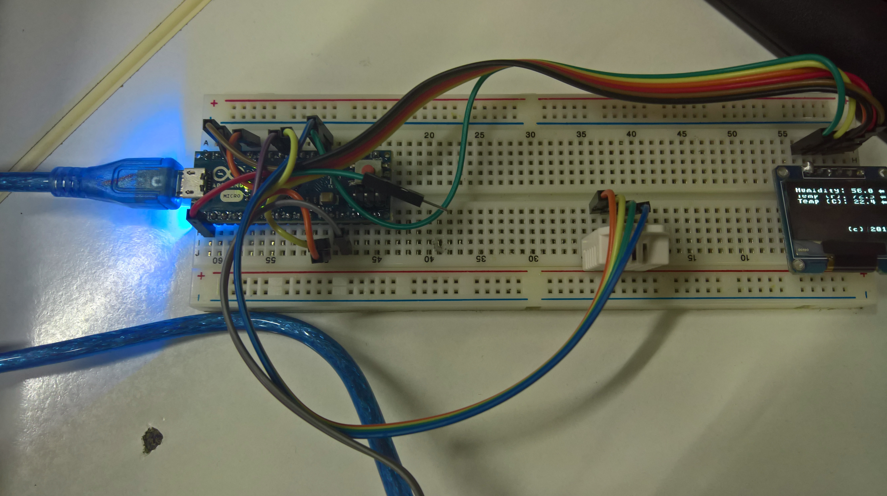

# arduinotalkiegr
Ένα θερμόμετρο που μιλάει με το Arduino, έναν αισθητήρα RH03 και ένα 0.96 OLED display SSD1306.
Στα πλαίσια ενός σεμιναρίου για το Arduino, αναπτύχθηκε μια εφαρμογή η οποία διαβάζει την θερμοκρασία και την υγρασία από έναν ψηφιακό αισθητήρα, την απεικονίζει σε ένα OLED 0.96 inch display, ανάλυσης 128x64 και εκφωνεί την θερμοκρασία και την υγρασία χρησιμοποιώντας την βιβλιοθήκη talkie.
Η βιβλιοθήκη talkie https://github.com/going-digital/Talkie , μας επιτρέπει να κάνουμε το Arduino να μιλάει καθώς μπορούμε χρησιμοποιώντας τη να συμπιέσουμε πάρα πολύ ομιλία έτσι ώστε να χωρέσουμε αρκετές δεκάδες λέξεις στη μικρή μνήμη flash του arduino.
Η βιβλιοθήκη talkie χρησιμοποιεί Linear Predictive Coding (LPC για συντομία) και για αυτό το σκοπό χρειαζόμαστε ένα πρόγραμμα που θα μετατρέπει ένα πλήθος αρχείων με ομιλία μορφής .wav σε ένα σύνολο από bytes κατάλληλο για χρήση από τη βιβλιοθήκη talkie.
Το αρχικό πρόγραμμα κωδικοποίησης wav σε LPC μπορείτε να το βρείτε εδώ: https://github.com/ptwz/python_wizard
Στην παρούσα διανομή κώδικα θα το βρείτε ελαφρά τροποποιημένο από εμένα. Το πρόγραμμα κωδικοποίησης είναι γραμμένο σε python και χρειάζεται να έχετε εγκαταστήσει το πακέτο SciPy για να δουλέψει ο κωδικοποιητής.

Χρήση
Κάντε τη συνδεσμολογία που βλέπετε στις προηγούμενες φωτογραφίες. (Θα υπάρξει στο μέλλον αναλυτικό σχεδιάγραμμα)
Κατεβάστε το zip αρχείο και αποσυμπιέστε το. Αντιγράψτε τους φακέλους που βρίσκονται στο φάκελο libraries μέσα στο φάκελο libraries που έχετε τις βιβλιοθήκες του Arduino.
Ανοίξτε το αρχείο htsensor/htsensor.ino
Κάντε compile τον κώδικα και κατεβάστε τον.

Μπορείτε να βρείτε χρήσιμη τη συνάρτηση say number που θα βρείτε στο htsensor/htsensor.ino. Η συνάρτηση αυτή εκφωνεί έναν floating point αριθμό. Χρειάζεται και την sayThreeDigits που θα βρείτε στο ίδιο αρχείο.
Για να ακούσετε τη φωνή μπορείτε να συνδέσετε ένα μεγαφωνάκι στο ground και στο pin 3 αν έχετε ένα arduino με επεξεργαστή atmega 328p (Arduino UNO) ή στο pin 5 αν έχετε arduino με επεξεργαστή 32U4 (Arduino Leonardo)